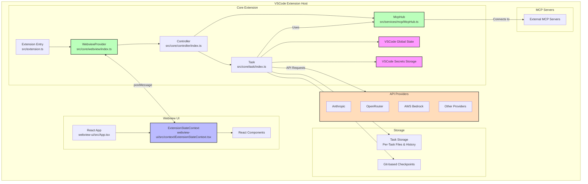

# Cline Extension Architecture & Development Guide

## Project Overview

Cline is a VSCode extension that provides AI assistance through a combination of a core extension backend and a React-based webview frontend. The extension is built with TypeScript and follows a modular architecture pattern.

## Architecture Overview



## Definitions 

- **Core Extension**: Anything inside the src folder, organized into modular components
- **Core Extension State**: Managed by the Controller class in src/core/controller/index.ts, which serves as the single source of truth for the extension's state. It manages multiple types of persistent storage (global state, workspace state, and secrets), handles state distribution to both the core extension and webview components, and coordinates state across multiple extension instances. This includes managing API configurations, task history, settings, and MCP configurations.
- **Webview**: Anything inside the webview-ui. All the react or view's seen by the user and user interaction components
- **Webview State**: Managed by ExtensionStateContext in webview-ui/src/context/ExtensionStateContext.tsx, which provides React components with access to the extension's state through a context provider pattern. It maintains local state for UI components, handles real-time updates through message events, manages partial message updates, and provides methods for state modifications. The context includes extension version, messages, task history, theme, API configurations, MCP servers, marketplace catalog, and workspace file paths. It synchronizes with the core extension through VSCode's message passing system and provides type-safe access to state through a custom hook (useExtensionState).

### Core Extension Architecture

The core extension follows a clear hierarchical structure:

1. **WebviewProvider** (src/core/webview/index.ts): Manages the webview lifecycle and communication
2. **Controller** (src/core/controller/index.ts): Handles webview messages and task management
3. **Task** (src/core/task/index.ts): Executes API requests and tool operations

This architecture provides clear separation of concerns:
- WebviewProvider focuses on VSCode webview integration
- Controller manages state and coordinates tasks
- Task handles the execution of AI requests and tool operations

### WebviewProvider Implementation

The WebviewProvider class in `src/core/webview/index.ts` is responsible for:

- Managing multiple active instances through a static set (`activeInstances`)
- Handling webview lifecycle events (creation, visibility changes, disposal)
- Implementing HTML content generation with proper CSP headers
- Supporting Hot Module Replacement (HMR) for development
- Setting up message listeners between the webview and extension

The WebviewProvider maintains a reference to the Controller and delegates message handling to it. It also handles the creation of both sidebar and tab panel webviews, allowing Cline to be used in different contexts within VSCode.

### Core Extension State

The `Controller` class manages multiple types of persistent storage:

- **Global State:** Stored across all VSCode instances. Used for settings and data that should persist globally.
- **Workspace State:** Specific to the current workspace. Used for task-specific data and settings.
- **Secrets:** Secure storage for sensitive information like API keys.

The `Controller` handles the distribution of state to both the core extension and webview components. It also coordinates state across multiple extension instances, ensuring consistency.

State synchronization between instances is handled through:
- File-based storage for task history and conversation data
- VSCode's global state API for settings and configuration
- Secrets storage for sensitive information
- Event listeners for file changes and configuration updates

The Controller implements methods for:
- Saving and loading task state
- Managing API configurations
- Handling user authentication
- Coordinating MCP server connections
- Managing task history and checkpoints

### Webview State

The `ExtensionStateContext` in `webview-ui/src/context/ExtensionStateContext.tsx` provides React components with access to the extension's state. It uses a context provider pattern and maintains local state for UI components. The context includes:

- Extension version
- Messages
- Task history
- Theme
- API configurations
- MCP servers
- Marketplace catalog
- Workspace file paths

It synchronizes with the core extension through VSCode's message passing system and provides type-safe access to the state via a custom hook (`useExtensionState`).

The ExtensionStateContext handles:
- Real-time updates through message events
- Partial message updates for streaming content
- State modifications through setter methods
- Type-safe access to state through a custom hook

## API Provider System

Cline supports multiple AI providers through a modular API provider system. Each provider is implemented as a separate module in the `src/api/providers/` directory and follows a common interface.

### API Provider Architecture

The API system consists of:

1. **API Handlers**: Provider-specific implementations in `src/api/providers/`
2. **API Transformers**: Stream transformation utilities in `src/api/transform/`
3. **API Configuration**: User settings for API keys and endpoints
4. **API Factory**: Builder function to create the appropriate handler

Key providers include:
- **Anthropic**: Direct integration with Claude models
- **OpenRouter**: Meta-provider supporting multiple model providers
- **AWS Bedrock**: Integration with Amazon's AI services
- **Gemini**: Google's AI models
- **Ollama**: Local model hosting
- **LM Studio**: Local model hosting
- **VSCode LM**: VSCode's built-in language models

### API Configuration Management

API configurations are stored securely:
- API keys are stored in VSCode's secrets storage
- Model selections and non-sensitive settings are stored in global state
- The Controller manages switching between providers and updating configurations

The system supports:
- Secure storage of API keys
- Model selection and configuration
- Automatic retry and error handling
- Token usage tracking and cost calculation
- Context window management

### Plan/Act Mode API Configuration

Cline supports separate model configurations for Plan and Act modes:
- Different models can be used for planning vs. execution
- The system preserves model selections when switching modes
- The Controller handles the transition between modes and updates the API configuration accordingly

## Task Execution System

The Task class is responsible for executing AI requests and tool operations. Each task runs in its own instance of the Task class, ensuring isolation and proper state management.

### Task Execution Loop

The core task execution loop follows this pattern:

```typescript
class Task {
  async initiateTaskLoop(userContent: UserContent, isNewTask: boolean) {
    while (!this.abort) {
      // 1. Make API request and stream response
      const stream = this.attemptApiRequest()
      
      // 2. Parse and present content blocks
      for await (const chunk of stream) {
        switch (chunk.type) {
          case "text":
            // Parse into content blocks
            this.assistantMessageContent = parseAssistantMessage(chunk.text)
            // Present blocks to user
            await this.presentAssistantMessage()
            break
        }
      }
      
      // 3. Wait for tool execution to complete
      await pWaitFor(() => this.userMessageContentReady)
      
      // 4. Continue loop with tool result
      const recDidEndLoop = await this.recursivelyMakeClineRequests(
        this.userMessageContent
      )
    }
  }
}
```

### Message Streaming System

The streaming system handles real-time updates and partial content:

```typescript
class Task {
  async presentAssistantMessage() {
    // Handle streaming locks to prevent race conditions
    if (this.presentAssistantMessageLocked) {
      this.presentAssistantMessageHasPendingUpdates = true
      return
    }
    this.presentAssistantMessageLocked = true

    // Present current content block
    const block = this.assistantMessageContent[this.currentStreamingContentIndex]
    
    // Handle different types of content
    switch (block.type) {
      case "text":
        await this.say("text", content, undefined, block.partial)
        break
      case "tool_use":
        // Handle tool execution
        break
    }

    // Move to next block if complete
    if (!block.partial) {
      this.currentStreamingContentIndex++
    }
  }
}
```

### Tool Execution Flow

Tools follow a strict execution pattern:

```typescript
class Task {
  async executeToolWithApproval(block: ToolBlock) {
    // 1. Check auto-approval settings
    if (this.shouldAutoApproveTool(block.name)) {
      await this.say("tool", message)
      this.consecutiveAutoApprovedRequestsCount++
    } else {
      // 2. Request user approval
      const didApprove = await askApproval("tool", message)
      if (!didApprove) {
        this.didRejectTool = true
        return
      }
    }

    // 3. Execute tool
    const result = await this.executeTool(block)

    // 4. Save checkpoint
    await this.saveCheckpoint()

    // 5. Return result to API
    return result
  }
}
```

### Error Handling & Recovery

The system includes robust error handling:

```typescript
class Task {
  async handleError(action: string, error: Error) {
    // 1. Check if task was abandoned
    if (this.abandoned) return
    
    // 2. Format error message
    const errorString = `Error ${action}: ${error.message}`
    
    // 3. Present error to user
    await this.say("error", errorString)
    
    // 4. Add error to tool results
    pushToolResult(formatResponse.toolError(errorString))
    
    // 5. Cleanup resources
    await this.diffViewProvider.revertChanges()
    await this.browserSession.closeBrowser()
  }
}
```

### API Request & Token Management

The Task class handles API requests with built-in retry, streaming, and token management:

```typescript
class Task {
  async *attemptApiRequest(previousApiReqIndex: number): ApiStream {
    // 1. Wait for MCP servers to connect
    await pWaitFor(() => this.controllerRef.deref()?.mcpHub?.isConnecting !== true)

    // 2. Manage context window
    const previousRequest = this.clineMessages[previousApiReqIndex]
    if (previousRequest?.text) {
      const { tokensIn, tokensOut } = JSON.parse(previousRequest.text || "{}")
      const totalTokens = (tokensIn || 0) + (tokensOut || 0)
      
      // Truncate conversation if approaching context limit
      if (totalTokens >= maxAllowedSize) {
        this.conversationHistoryDeletedRange = this.contextManager.getNextTruncationRange(
          this.apiConversationHistory,
          this.conversationHistoryDeletedRange,
          totalTokens / 2 > maxAllowedSize ? "quarter" : "half"
        )
      }
    }

    // 3. Handle streaming with automatic retry
    try {
      this.isWaitingForFirstChunk = true
      const firstChunk = await iterator.next()
      yield firstChunk.value
      this.isWaitingForFirstChunk = false
      
      // Stream remaining chunks
      yield* iterator
    } catch (error) {
      // 4. Error handling with retry
      if (isOpenRouter && !this.didAutomaticallyRetryFailedApiRequest) {
        await setTimeoutPromise(1000)
        this.didAutomaticallyRetryFailedApiRequest = true
        yield* this.attemptApiRequest(previousApiReqIndex)
        return
      }
      
      // 5. Ask user to retry if automatic retry failed
      const { response } = await this.ask(
        "api_req_failed",
        this.formatErrorWithStatusCode(error)
      )
      if (response === "yesButtonClicked") {
        await this.say("api_req_retried")
        yield* this.attemptApiRequest(previousApiReqIndex)
        return
      }
    }
  }
}
```

Key features:

1. **Context Window Management**
   - Tracks token usage across requests
   - Automatically truncates conversation when needed
   - Preserves important context while freeing space
   - Handles different model context sizes

2. **Streaming Architecture**
   - Real-time chunk processing
   - Partial content handling
   - Race condition prevention
   - Error recovery during streaming

3. **Error Handling**
   - Automatic retry for transient failures
   - User-prompted retry for persistent issues
   - Detailed error reporting
   - State cleanup on failure

4. **Token Tracking**
   - Per-request token counting
   - Cumulative usage tracking
   - Cost calculation
   - Cache hit monitoring

### Context Management System

The Context Management System handles conversation history truncation to prevent context window overflow errors. Implemented in the `ContextManager` class, it ensures long-running conversations remain within model context limits while preserving critical context.

Key features:

1. **Model-Aware Sizing**: Dynamically adjusts based on different model context windows (64K for DeepSeek, 128K for most models, 200K for Claude).

2. **Proactive Truncation**: Monitors token usage and preemptively truncates conversations when approaching limits, maintaining buffers of 27K-40K tokens depending on the model.

3. **Intelligent Preservation**: Always preserves the original task message and maintains the user-assistant conversation structure when truncating.

4. **Adaptive Strategies**: Uses different truncation strategies based on context pressure - removing half of the conversation for moderate pressure or three-quarters for severe pressure.

5. **Error Recovery**: Includes specialized detection for context window errors from different providers with automatic retry and more aggressive truncation when needed.

### Task State & Resumption

The Task class provides robust task state management and resumption capabilities:

```typescript
class Task {
  async resumeTaskFromHistory() {
    // 1. Load saved state
    this.clineMessages = await getSavedClineMessages(this.getContext(), this.taskId)
    this.apiConversationHistory = await getSavedApiConversationHistory(this.getContext(), this.taskId)

    // 2. Handle interrupted tool executions
    const lastMessage = this.apiConversationHistory[this.apiConversationHistory.length - 1]
    if (lastMessage.role === "assistant") {
      const toolUseBlocks = content.filter(block => block.type === "tool_use")
      if (toolUseBlocks.length > 0) {
        // Add interrupted tool responses
        const toolResponses = toolUseBlocks.map(block => ({
          type: "tool_result",
          tool_use_id: block.id,
          content: "Task was interrupted before this tool call could be completed."
        }))
        modifiedOldUserContent = [...toolResponses]
      }
    }

    // 3. Notify about interruption
    const agoText = this.getTimeAgoText(lastMessage?.ts)
    newUserContent.push({
      type: "text",
      text: `[TASK RESUMPTION] This task was interrupted ${agoText}. It may or may not be complete, so please reassess the task context.`
    })

    // 4. Resume task execution
    await this.initiateTaskLoop(newUserContent, false)
  }

  private async saveTaskState() {
    // Save conversation history
    await saveApiConversationHistory(this.getContext(), this.taskId, this.apiConversationHistory)
    await saveClineMessages(this.getContext(), this.taskId, this.clineMessages)
    
    // Create checkpoint
    const commitHash = await this.checkpointTracker?.commit()
    
    // Update task history
    await this.controllerRef.deref()?.updateTaskHistory({
      id: this.taskId,
      ts: lastMessage.ts,
      task: taskMessage.text,
      // ... other metadata
    })
  }
}
```

Key aspects of task state management:

1. **Task Persistence**
   - Each task has a unique ID and dedicated storage directory
   - Conversation history is saved after each message
   - File changes are tracked through Git-based checkpoints
   - Terminal output and browser state are preserved

2. **State Recovery**
   - Tasks can be resumed from any point
   - Interrupted tool executions are handled gracefully
   - File changes can be restored from checkpoints
   - Context is preserved across VSCode sessions

3. **Workspace Synchronization**
   - File changes are tracked through Git
   - Checkpoints are created after tool executions
   - State can be restored to any checkpoint
   - Changes can be compared between checkpoints

4. **Error Recovery**
   - Failed API requests can be retried
   - Interrupted tool executions are marked
   - Resources are cleaned up properly
   - User is notified of state changes

## Plan/Act Mode System

Cline implements a dual-mode system that separates planning from execution:

### Mode Architecture

The Plan/Act mode system consists of:

1. **Mode State**: Stored in `chatSettings.mode` in the Controller's state
2. **Mode Switching**: Handled by `togglePlanActModeWithChatSettings` in the Controller
3. **Mode-specific Models**: Optional configuration to use different models for each mode
4. **Mode-specific Prompting**: Different system prompts for planning vs. execution

### Mode Switching Process

When switching between modes:

1. The current model configuration is saved to mode-specific state
2. The previous mode's model configuration is restored
3. The Task instance is updated with the new mode
4. The webview is notified of the mode change
5. Telemetry events are captured for analytics

### Plan Mode

Plan mode is designed for:
- Information gathering and context building
- Asking clarifying questions
- Creating detailed execution plans
- Discussing approaches with the user

In Plan mode, the AI uses the `plan_mode_respond` tool to engage in conversational planning without executing actions.

### Act Mode

Act mode is designed for:
- Executing the planned actions
- Using tools to modify files, run commands, etc.
- Implementing the solution
- Providing results and completion feedback

In Act mode, the AI has access to all tools except `plan_mode_respond` and focuses on implementation rather than discussion.

## Data Flow & State Management

### Core Extension Role

The Controller acts as the single source of truth for all persistent state. It:
- Manages VSCode global state and secrets storage
- Coordinates state updates between components
- Ensures state consistency across webview reloads
- Handles task-specific state persistence
- Manages checkpoint creation and restoration

### Terminal Management

The Task class manages terminal instances and command execution:

```typescript
class Task {
  async executeCommandTool(command: string): Promise<[boolean, ToolResponse]> {
    // 1. Get or create terminal
    const terminalInfo = await this.terminalManager.getOrCreateTerminal(cwd)
    terminalInfo.terminal.show()

    // 2. Execute command with output streaming
    const process = this.terminalManager.runCommand(terminalInfo, command)
    
    // 3. Handle real-time output
    let result = ""
    process.on("line", (line) => {
      result += line + "\n"
      if (!didContinue) {
        sendCommandOutput(line)
      } else {
        this.say("command_output", line)
      }
    })

    // 4. Wait for completion or user feedback
    let completed = false
    process.once("completed", () => {
      completed = true
    })

    await process

    // 5. Return result
    if (completed) {
      return [false, `Command executed.\n${result}`]
    } else {
      return [
        false,
        `Command is still running in the user's terminal.\n${result}\n\nYou will be updated on the terminal status and new output in the future.`
      ]
    }
  }
}
```

Key features:
1. **Terminal Instance Management**
   - Multiple terminal support
   - Terminal state tracking (busy/inactive)
   - Process cooldown monitoring
   - Output history per terminal

2. **Command Execution**
   - Real-time output streaming
   - User feedback handling
   - Process state monitoring
   - Error recovery

### Browser Session Management

The Task class handles browser automation through Puppeteer:

```typescript
class Task {
  async executeBrowserAction(action: BrowserAction): Promise<BrowserActionResult> {
    switch (action) {
      case "launch":
        // 1. Launch browser with fixed resolution
        await this.browserSession.launchBrowser()
        return await this.browserSession.navigateToUrl(url)

      case "click":
        // 2. Handle click actions with coordinates
        return await this.browserSession.click(coordinate)

      case "type":
        // 3. Handle keyboard input
        return await this.browserSession.type(text)

      case "close":
        // 4. Clean up resources
        return await this.browserSession.closeBrowser()
    }
  }
}
```

Key aspects:
1. **Browser Control**
   - Fixed 900x600 resolution window
   - Single instance per task lifecycle
   - Automatic cleanup on task completion
   - Console log capture

2. **Interaction Handling**
   - Coordinate-based clicking
   - Keyboard input simulation
   - Screenshot capture
   - Error recovery

## MCP (Model Context Protocol) Integration

### MCP Architecture

The MCP system consists of:

1. **McpHub Class**: Central manager in `src/services/mcp/McpHub.ts`
2. **MCP Connections**: Manages connections to external MCP servers
3. **MCP Settings**: Configuration stored in a JSON file
4. **MCP Marketplace**: Online catalog of available MCP servers
5. **MCP Tools & Resources**: Capabilities exposed by connected servers

The McpHub class:
- Manages the lifecycle of MCP server connections
- Handles server configuration through a settings file
- Provides methods for calling tools and accessing resources
- Implements auto-approval settings for MCP tools
- Monitors server health and handles reconnection

### MCP Server Types

Cline supports two types of MCP server connections:
- **Stdio**: Command-line based servers that communicate via standard I/O
- **SSE**: HTTP-based servers that communicate via Server-Sent Events

### MCP Server Management

The McpHub class provides methods for:
- Discovering and connecting to MCP servers
- Monitoring server health and status
- Restarting servers when needed
- Managing server configurations
- Setting timeouts and auto-approval rules

### MCP Tool Integration

MCP tools are integrated into the Task execution system:
- Tools are discovered and registered at connection time
- The Task class can call MCP tools through the McpHub
- Tool results are streamed back to the AI
- Auto-approval settings can be configured per tool

### MCP Marketplace

The MCP Marketplace provides:
- A catalog of available MCP servers
- One-click installation
- README previews
- Server status monitoring

The Controller class manages MCP servers through the McpHub service:

```typescript
class Controller {
  mcpHub?: McpHub

  constructor(context: vscode.ExtensionContext, outputChannel: vscode.OutputChannel, webviewProvider: WebviewProvider) {
    this.mcpHub = new McpHub(this)
  }

  async downloadMcp(mcpId: string) {
    // Fetch server details from marketplace
    const response = await axios.post<McpDownloadResponse>(
      "https://api.cline.bot/v1/mcp/download",
      { mcpId },
      {
        headers: { "Content-Type": "application/json" },
        timeout: 10000,
      }
    )

    // Create task with context from README
    const task = `Set up the MCP server from ${mcpDetails.githubUrl}...`

    // Initialize task and show chat view
    await this.initClineWithTask(task)
  }
}
```

## Conclusion

This guide provides a comprehensive overview of the Cline extension architecture, with special focus on state management, data persistence, and code organization. Following these patterns ensures robust feature implementation with proper state handling across the extension's components.

Remember:
- Always persist important state in the extension
- The core extension follows a WebviewProvider -> Controller -> Task flow
- Use proper typing for all state and messages
- Handle errors and edge cases
- Test state persistence across webview reloads
- Follow the established patterns for consistency
- Place new code in appropriate directories
- Maintain clear separation of concerns
- Install dependencies in correct package.json

## Contributing

Contributions to the Cline extension are welcome! Please follow these guidelines:

When adding new tools or API providers, follow the existing patterns in the `src/integrations/` and `src/api/providers/` directories, respectively. Ensure that your code is well-documented and includes appropriate error handling.

The `.clineignore` file allows users to specify files and directories that Cline should not access. When implementing new features, respect the `.clineignore` rules and ensure that your code does not attempt to read or modify ignored files.